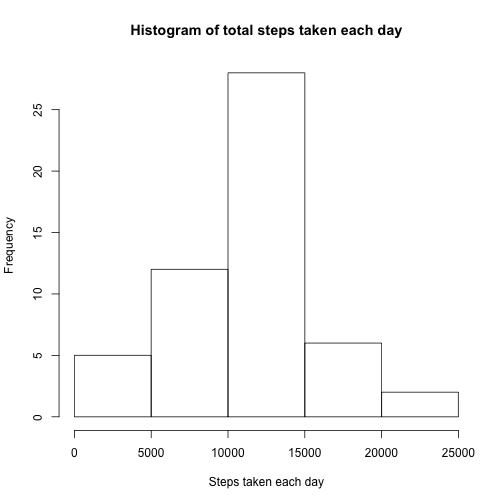
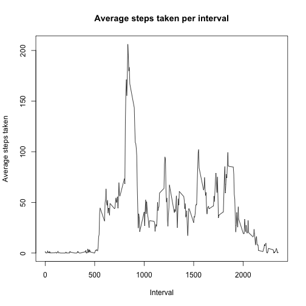
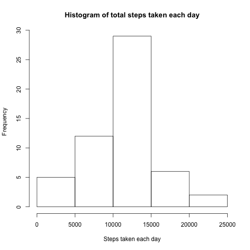
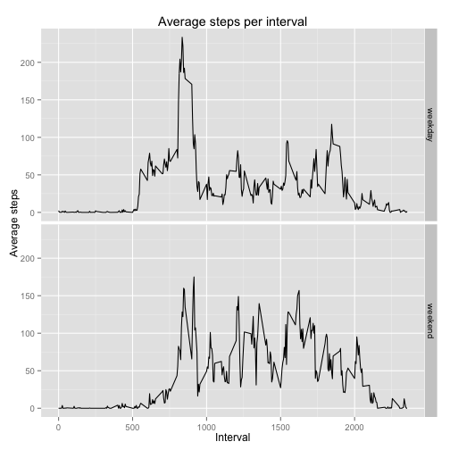

R Markdown Peer Assessment 1 Assignment
========================================

#Introduction
The aim of this assignment is to answer specific questions regarding personal movement by analyzing data about an anaonymous individual's personal movement. The data has been collected using an activity montioring device. This device collects data at 5 minute intervals through out the day. The data consists of two months of data from an anonymous individual collected during the months of October and November, 2012 and include the number of steps taken in 5 minute intervals each day.

#About the data
The data is available in zip format [here](https://d396qusza40orc.cloudfront.net/repdata%2Fdata%2Factivity.zip). This has been manually downloaded and unzipped into the working directory. The resulting file is **activity.csv**.  

The variables included in this dataset are:  
1. steps: Number of steps taking in a 5-minute interval (missing values are coded as NA)  
2. date: The date on which the measurement was taken in YYYY-MM-DD format  
3. interval: Identifier for the 5-minute interval in which measurement was taken  

The dataset is stored in a comma-separated-value (CSV) file and there are a total of 17,568 observations in this dataset.

#Loading the data
The data is read into a data frame and the structure is studied:  


```r
activity_data <- read.csv("activity.csv")
str (activity_data)
```

```
## 'data.frame':	17568 obs. of  3 variables:
##  $ steps   : int  NA NA NA NA NA NA NA NA NA NA ...
##  $ date    : Factor w/ 61 levels "2012-10-01","2012-10-02",..: 1 1 1 1 1 1 1 1 1 1 ...
##  $ interval: int  0 5 10 15 20 25 30 35 40 45 ...
```

The **date** column needs to be transformed from factor to date. 

```r
activity_data$date <- as.Date(activity_data$date, format="%Y-%m-%d")
str(activity_data)
```

```
## 'data.frame':	17568 obs. of  3 variables:
##  $ steps   : int  NA NA NA NA NA NA NA NA NA NA ...
##  $ date    : Date, format: "2012-10-01" "2012-10-01" ...
##  $ interval: int  0 5 10 15 20 25 30 35 40 45 ...
```

#What is mean total number of steps taken per day?
This section plots a histogram of the total number of steps taken every day and then publishes the mean and the median. 

To calculate the total number of steps taken per day, we need to aggregate the data frame on a daily basis. NAs can be ignored. After this, a histogram of the total number of steps taken each day is plotted and the mean and median are calculated.


```r
total_steps <- aggregate(steps ~ date, data = activity_data, FUN=sum)
hist(total_steps$steps, xlab = "Steps taken each day", main = "Histogram of total steps taken each day")
```

 


```r
mean_steps_each_day <- mean(total_steps$steps)
median_steps_each_day <- median(total_steps$steps)
```

**The mean steps taken per day are 1.0766189 &times; 10<sup>4</sup> and the median of steps taken per day is 10765.** 

#What is the average daily activity pattern?
This section plots the average number of steps taken over every 5 minute interval. 

To do this, we need to aggregate the data frame over each interval with an average of steps taken.


```r
per_int_steps <- aggregate(steps ~ interval, data=activity_data, FUN=mean)
plot(per_int_steps$interval, per_int_steps$steps, type = "l", main="Average steps taken per interval", xlab = "Interval", ylab="Average steps taken")
```

 


```r
max_int <- per_int_steps[which.max(per_int_steps$steps),]
```

**The 5-minute interval that contains the maximum number of average steps taken is interval 835**

#Imputing missing values
This section deals with missing values and substituting them with sensible replacements and then analyzing the change in the results found in question 1.

First, calculate the number of rows with missing values - 


```r
missing <- activity_data[is.na(activity_data$steps), ]
```

**The number of rows with missing values is 2304**

Second, fill in missing values with the rounded mean of that 5 minute interval (as calculated in question 2 above)


```r
nonnull_activity_data <- transform(activity_data, steps = ifelse(is.na(steps), round(per_int_steps[(interval == interval),]$steps), steps))
head(nonnull_activity_data)
```

```
##   steps       date interval
## 1     2 2012-10-01        0
## 2     0 2012-10-01        5
## 3     0 2012-10-01       10
## 4     0 2012-10-01       15
## 5     0 2012-10-01       20
## 6     2 2012-10-01       25
```

Third, re-calculate the total number of steps taken per day - we need to aggregate the data frame on a daily basis. After this, a histogram of the total number of steps taken each day is plotted and the mean and median are calculated.


```r
total_steps_non_null <- aggregate(steps ~ date, data = nonnull_activity_data, FUN=sum)
hist(total_steps_non_null$steps, xlab = "Steps taken each day", main = "Histogram of total steps taken each day")
```

 


```r
mean_steps_each_day_nonnull <- mean(total_steps_non_null$steps)
median_steps_each_day_nonnull <- median(total_steps_non_null$steps)
```

**The mean steps taken per day are 1.0766111 &times; 10<sup>4</sup> and the median of steps taken per day is 1.07635 &times; 10<sup>4</sup>.** 


**Effect of imputing missing data** is dependent on the replacement value used for missing values. 


```r
finaldt <- data.frame(Dataset = c("Original", "Filled-in"), Mean = c(mean_steps_each_day, mean_steps_each_day_nonnull), Median = c(median_steps_each_day, median_steps_each_day_nonnull))
library(xtable)
xt <- xtable(finaldt)
print (xt, type="html")
```

<!-- html table generated in R 3.2.1 by xtable 1.7-4 package -->
<!-- Sun Oct 18 22:39:33 2015 -->
<table border=1>
<tr> <th>  </th> <th> Dataset </th> <th> Mean </th> <th> Median </th>  </tr>
  <tr> <td align="right"> 1 </td> <td> Original </td> <td align="right"> 10766.19 </td> <td align="right"> 10765.00 </td> </tr>
  <tr> <td align="right"> 2 </td> <td> Filled-in </td> <td align="right"> 10766.11 </td> <td align="right"> 10763.50 </td> </tr>
   </table>
  
  
In this case, the **mean has hardly changed** due to the replacement and the **median has reduced by 1.5 steps**, which is neglibible. 
  
**So we can conclude that the results have not changed due to the replacement.** 

#Are there differences in activity patterns between weekdays and weekends?

This section analyzes the difference in activities on weekdays and weekends. First, a DayType column is added to the NA-replaced activity data created above.


```r
nonnull_activity_data$DayType <-  ifelse( weekdays(nonnull_activity_data$date) %in% c("Saturday", "Sunday"), "weekend", "weekday")
nonnull_activity_data$DayType <- as.factor(nonnull_activity_data$DayType)
str(nonnull_activity_data)
```

```
## 'data.frame':	17568 obs. of  4 variables:
##  $ steps   : num  2 0 0 0 0 2 1 1 0 1 ...
##  $ date    : Date, format: "2012-10-01" "2012-10-01" ...
##  $ interval: int  0 5 10 15 20 25 30 35 40 45 ...
##  $ DayType : Factor w/ 2 levels "weekday","weekend": 1 1 1 1 1 1 1 1 1 1 ...
```

Then the average steps per interval is calculated for weekends and weekdays.


```r
#find average steps per interval for weekdays
nonnull_per_int_steps_weekday <- aggregate(steps ~ interval,  data=nonnull_activity_data[(nonnull_activity_data$DayType == "weekday"),], FUN=mean)
nonnull_per_int_steps_weekday$DayType <- "weekday"

#find average steps per interval for weekend
nonnull_per_int_steps_weekend <- aggregate(steps ~ interval, data=nonnull_activity_data[(nonnull_activity_data$DayType == "weekend"),], FUN=mean)
nonnull_per_int_steps_weekend$DayType <- "weekend"

#combine to create single data frame
nonnull_per_int_steps <- rbind(nonnull_per_int_steps_weekday, nonnull_per_int_steps_weekend)
```

Next, to analyze difference in activities on weekdays and weekends separately, the ggplot library is used to create a multipanel plot.


```r
library(ggplot2)
ggplot(nonnull_per_int_steps, aes(interval, steps, group=1)) + facet_grid(DayType ~ . ) + geom_line() + labs(x="Interval", y="Average steps", title="Average steps per interval")
```

 

